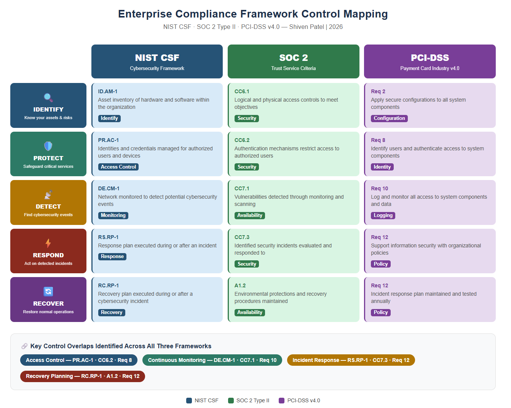

# Compliance Framework Mapping

## Overview
This project maps enterprise security controls across NIST CSF, 
SOC 2 Type II, and PCI-DSS frameworks to identify overlapping 
requirements and support compliance-driven security operations.

Understanding how these frameworks relate to each other is critical 
for security analysts working in enterprise environments, it allows 
organizations to satisfy multiple compliance requirements 
simultaneously rather than treating each framework as a separate workstream.

## Frameworks Covered

### NIST Cybersecurity Framework (CSF)
A voluntary framework developed by NIST consisting of five core 
functions: Identify, Protect, Detect, Respond, and Recover. 
Widely adopted by US enterprises and government agencies as a 
baseline for cybersecurity risk management.

### SOC 2 Type II
An auditing standard developed by the AICPA focused on five Trust 
Service Criteria: Security, Availability, Processing Integrity, 
Confidentiality, and Privacy. Required by many enterprise clients 
when evaluating vendors and service providers.

### PCI-DSS
The Payment Card Industry Data Security Standard, a mandatory 
compliance framework for any organization that handles credit card 
data. Consists of 12 core requirements covering network security, 
access control, monitoring, and testing.

## Control Mapping

| NIST CSF Function | NIST CSF Control | SOC 2 Criteria | PCI-DSS Requirement |
|---|---|---|---|
| Identify | ID.AM-1: Asset Inventory | CC6.1 | Req 2: System Defaults |
| Protect | PR.AC-1: Access Management | CC6.2 | Req 8: Access Control |
| Protect | PR.DS-1: Data Protection | C1.1 | Req 3: Cardholder Data |
| Detect | DE.CM-1: Continuous Monitoring | CC7.1 | Req 10: Log Monitoring |
| Detect | DE.CM-7: Unauthorized Activity | CC7.2 | Req 11: Security Testing |
| Respond | RS.RP-1: Response Planning | CC7.3 | Req 12: Security Policy |
| Recover | RC.RP-1: Recovery Planning | A1.2 | Req 12: Security Policy |

## Key Findings
- Access control requirements appear across all three frameworks 
  under different names but share the same underlying objective, 
  limiting system access to authorized users only
- Continuous monitoring is a shared requirement between NIST DE.CM, 
  SOC 2 CC7.1, and PCI-DSS Requirement 10, a single monitoring 
  solution can satisfy all three simultaneously
- Incident response planning (NIST RS, SOC 2 CC7.3, PCI-DSS Req 12) 
  overlaps significantly, organizations can write one response plan 
  that satisfies all three frameworks

## Tools Used
- NIST CSF documentation (csf.tools)
- AICPA SOC 2 Trust Service Criteria
- PCI-DSS v4.0 Requirements

## Skills Demonstrated
- Compliance framework analysis
- Security control mapping
- Gap analysis documentation
- Enterprise risk management concepts
- Technical writing for security operations
